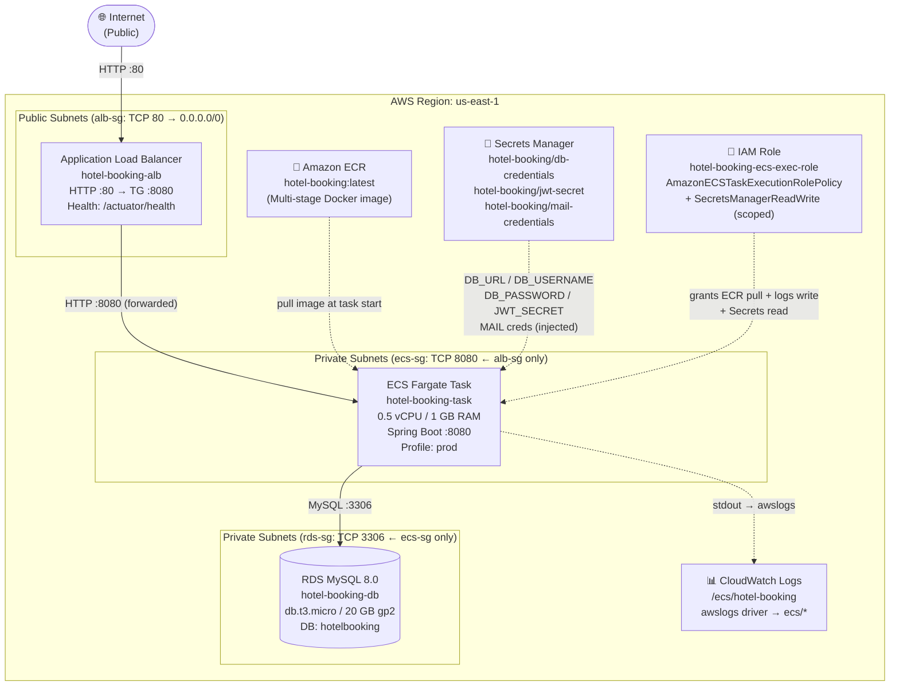

# AWS Architecture — Hotel Booking System

## Mermaid Diagram



## Text-Based Diagram

```
┌─────────────────────────────────────────────────────────────────────────┐
│                         AWS us-east-1                                   │
│                                                                         │
│  🌐 Internet                                                            │
│       │  HTTP :80                                                       │
│       ▼                                                                 │
│  ┌─────────────────────────────────────────────────────────────────┐   │
│  │  ALB  hotel-booking-alb  [alb-sg: 0.0.0.0/0 → :80]            │   │
│  │       Listener :80 → Target Group hotel-booking-tg :8080        │   │
│  │       Health check: GET /actuator/health                         │   │
│  └───────────────────────────┬─────────────────────────────────────┘   │
│                              │  HTTP :8080                              │
│                              ▼                                          │
│  ┌─────────────────────────────────────────────────────────────────┐   │
│  │  ECS Fargate  hotel-booking-service  [ecs-sg: alb-sg → :8080]  │   │
│  │  Task: hotel-booking-task (0.5 vCPU / 1 GB)                     │   │
│  │  Image: <acct>.dkr.ecr.us-east-1.amazonaws.com/hotel-booking    │   │
│  │  SPRING_PROFILES_ACTIVE=prod                                     │   │
│  │  DB_URL / DB_USERNAME / DB_PASSWORD / JWT_SECRET  ◄──┐          │   │
│  └───────────────────────────┬────────────────────────── │──────────┘   │
│                              │  MySQL :3306              │              │
│                              ▼                           │              │
│  ┌──────────────────────────────────────────┐           │              │
│  │  RDS MySQL 8.0  hotel-booking-db         │           │              │
│  │  [rds-sg: ecs-sg → :3306]                │   ┌───────┴──────────┐  │
│  │  db.t3.micro / 20 GB gp2 / Single-AZ     │   │  Secrets Manager │  │
│  │  DB: hotelbooking  user: admin            │   │  db-credentials  │  │
│  └──────────────────────────────────────────┘   │  jwt-secret      │  │
│                                                  │  mail-creds      │  │
│  ┌──────────────────────┐                        └──────────────────┘  │
│  │  ECR  hotel-booking  │   ◄─ docker push (CI/CD or manual)          │
│  │  image:latest        │   ──► pulled at ECS task launch              │
│  └──────────────────────┘                                              │
│                                                                         │
│  ┌──────────────────────────────────────────┐                          │
│  │  CloudWatch Logs  /ecs/hotel-booking     │                          │
│  │  stream prefix: ecs/                     │ ◄── awslogs driver       │
│  └──────────────────────────────────────────┘                          │
│                                                                         │
│  IAM: hotel-booking-ecs-exec-role                                       │
│       AmazonECSTaskExecutionRolePolicy + scoped SecretsManager read     │
└─────────────────────────────────────────────────────────────────────────┘
```

## Component Summary

| Component | AWS Service | Details |
|-----------|-------------|---------|
| Container registry | Amazon ECR | `hotel-booking` repo, scan-on-push |
| Compute | ECS Fargate | 0.5 vCPU, 1 GB RAM, 1 task |
| Load balancer | ALB | Internet-facing, HTTP :80 → :8080 |
| Database | RDS MySQL 8.0 | db.t3.micro, 20 GB gp2, Single-AZ |
| Secrets | Secrets Manager | DB creds, JWT secret, mail creds |
| Logs | CloudWatch Logs | `/ecs/hotel-booking` |
| Permissions | IAM Role | ECS task execution + scoped Secrets read |
| Network | VPC + Security Groups | 3 SGs with least-privilege ingress |
